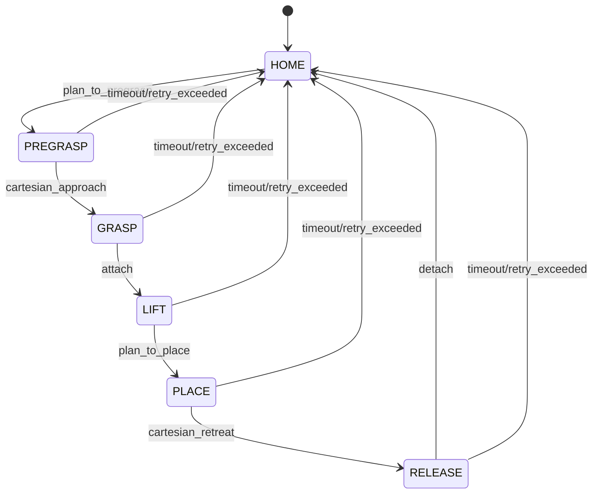

# ros2_manipulation_pick_place

**한 줄 요약:** Gazebo + MoveIt2에서 로봇팔 Pick & Place 자동화를 구현하고, 실패 복구/성능 지표 측정을 포함한 포트폴리오 프로젝트입니다.

## 빠른 시작
```bash
# 1) ROS2 Humble 환경 설정
source /opt/ros/humble/setup.bash

# 2) 워크스페이스 빌드
colcon build --symlink-install
source install/setup.bash

# 3) 데모 실행 (Gazebo + RViz2 + MoveIt2)
./scripts/run_demo.sh
```

## Mermaid 다이어그램 렌더링 방법
로컬에서 Mermaid CLI 또는 Docker를 사용해 PNG/SVG를 생성할 수 있습니다.
```bash
# Mermaid CLI (npm)
# npm install -g @mermaid-js/mermaid-cli
./scripts/render_diagrams.sh
```

## 시스템 아키텍처 (Mermaid 소스)
```mermaid
flowchart LR
  subgraph Simulation
    Gazebo[Gazebo Classic]\n(gazebo_ros)
    Robot[Robot Arm + ros2_control]
    Objects[Object/Obstacle]
  end
  subgraph Planning
    MoveIt[MoveIt2\nmove_group]
    PlanningScene[Planning Scene]
  end
  subgraph Application
    SM[Pick&Place State Machine\n(pick_place_task)]
    Metrics[Metrics Logger]
  end
  subgraph Visualization
    RViz[RViz2]
  end

  SM --> MoveIt
  MoveIt <--> PlanningScene
  PlanningScene --> Gazebo
  Gazebo --> Robot
  Objects --> Gazebo
  MoveIt --> RViz
  SM --> Metrics
```

## 상태 머신 (Mermaid 소스)


## 성능 지표
- 런타임 결과는 `logs/metrics.csv`로 기록됩니다.
- 그래프는 로컬에서 생성하세요:
```bash
python3 scripts/plot_metrics.py --input logs/metrics.csv --output docs/metrics
```

## 실패/복구 전략
- 자세한 내용: [docs/failure_recovery.md](docs/failure_recovery.md)

## Troubleshooting (8+)
1. `colcon build` 실패 시 `rosdep install`로 누락 의존성을 확인하세요.
2. Gazebo가 실행되지 않으면 `gazebo --verbose`로 로그를 확인하세요.
3. RViz2에 로봇이 보이지 않으면 TF 트리를 `ros2 run tf2_tools view_frames`로 점검하세요.
4. MoveIt2 플래닝 실패 시 collision object 좌표를 확인하세요.
5. `run_demo.sh` 권한 오류가 나면 `chmod +x scripts/*.sh`로 실행 권한을 부여하세요.
6. `metrics.csv`가 생성되지 않으면 `pick_place_task` 노드 로그를 확인하세요.
7. `plot_metrics.py` 실행 시 matplotlib 오류가 나면 `pip install matplotlib`를 설치하세요.
8. Gazebo가 하얀 화면이면 GPU/드라이버 상태를 확인하거나 `LIBGL_ALWAYS_SOFTWARE=1`을 사용하세요.
9. RViz2 플러그인 오류가 발생하면 `rviz2 -d`로 기본 구성 파일을 지정하세요.

## 한계/다음 단계
- 실제 하드웨어와의 통합 전, 로봇 모델/URDF/컨트롤러 구성이 필요합니다.
- 실제 비전 인식(카메라 기반 객체 검출) 연동은 후속 과제로 남겨두었습니다.
- 강화학습 기반 grasp pose 탐색을 추가할 수 있습니다.
