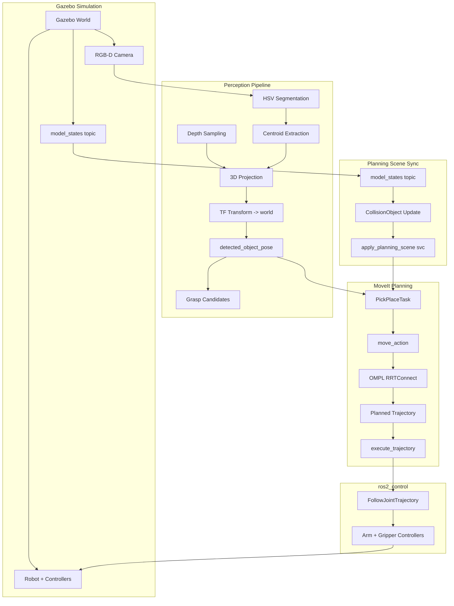

# Robot Arm Pick & Place (ROS 2 + Gazebo + MoveIt)

3-line summary:
- ROS 2 + Gazebo + MoveIt based 6-DOF pick-and-place simulation.
- RGB-D vision for object pose + grasp candidate generation.
- Repeatable experiments: stress test, color cycle, and metrics logging.

End-to-end simulation project for a 6-DOF robot arm performing pick-and-place with
vision-based perception, MoveIt planning, and Gazebo physics. This repo is set up
for repeatable experiments (stress tests, color cycles), and portfolio demos that
show full system integration.

## Highlights
- End-to-end ROS 2 stack: Gazebo + ros2_control + MoveIt + RViz.
- Vision-based pose estimation from RGB-D and grasp candidate generation.
- Staged task execution with retries, recovery, and CSV metrics.
- Planning scene kept synchronized with Gazebo models.
- Configurable for stress tests, color cycling, or single-run demos.

## System Architecture
High-level flow:
1) Gazebo sim publishes robot state, camera, and model poses.
2) Perception extracts object pose from RGB-D.
3) PickPlaceTask builds constraints and requests MoveIt plans.
4) Trajectories are executed by ros2_control controllers.
5) Planning scene is kept aligned with Gazebo objects.

## System Diagram (Unified)


## Design Decisions
Why these choices:
- RRTConnect as default planner: fast and reliable for 6-DOF in cluttered but bounded scenes; good balance of speed and success rate for demo loops.
- Stage-level retry: failures usually local (pose, grasp, attach). Retrying a stage is cheaper and more explainable than restarting a whole iteration.
- Split perception pipeline vs single node:
  - Split pipeline pros: easier debugging, modular tuning, reuse per component.
  - Split pipeline cons: more topics/latency, extra TF dependency.
  - Legacy single node: simpler wiring but harder to isolate failures.

## Project Layout
- `src/arm_description`: URDF/xacro, joints/links, ros2_control interfaces, Gazebo plugin.
- `src/arm_gazebo`: Gazebo world, models, controllers, bringup launch.
- `src/arm_moveit_config`: SRDF, kinematics, joint limits, OMPL planning, RViz config.
- `src/arm_moveit_task`: Task logic and perception nodes.

## Core Functionality
### Task Pipeline (PickPlaceTask)
Key file: `src/arm_moveit_task/arm_moveit_task/pick_place_task.py`

Stages:
- Home
- Pre-grasp
- Grasp
- Lift
- Pre-place
- Place
- Retreat

Features:
- Planning and execution via MoveIt actions
- Per-stage retries and recovery flow
- Metrics logging (plan/exec times, success/failure)
- Optional color cycling and stress test loops
- Force-home startup option and validity gate

### Perception Pipeline
Two options are provided:

1) Split pipeline (default)
- `color_detector_node.py`: HSV segmentation to detect target centroid
- `pose_estimator_node.py`: depth projection + TF transform -> PoseStamped
- `grasp_candidate_node.py`: pose offsets/yaw sampling for grasp candidates

2) Legacy single-node pipeline
- `perception_node.py`: combined color + depth + pose estimation

Key topics:
- `/overhead_camera/overhead_rgb/image_raw`
- `/overhead_camera/overhead/depth/image_raw`
- `/overhead_camera/overhead_rgb/camera_info`
- `/detected_object_pose`
- `/grasp_candidates`

## Nodes, Topics, and Interfaces
### Main Nodes
- `arm_pick_place_task` (PickPlaceTask)
- `arm_color_detector`, `arm_pose_estimator`, `arm_grasp_candidates` (split perception)
- `arm_perception_node` (legacy perception)

### Actions
- `/move_action` (MoveIt planning)
- `/execute_trajectory` (MoveIt execution)
- `/arm_controller/follow_joint_trajectory` (force-home)

### Services
- `/apply_planning_scene` (planning scene updates)
- `/get_planning_scene` (ACM retrieval)
- `/check_state_validity` (start state validation)
- `/spawn_entity`, `/delete_entity`, `/set_entity_state` (Gazebo entity management)

## Planning Scene Synchronization
The planning scene is kept aligned with Gazebo:
- Collision objects for table and boxes are created in MoveIt.
- Their poses are updated from `/model_states` at a fixed period.
- AllowedCollisionMatrix is inherited from MoveIt (SRDF) and extended only for
  visualization boxes (so SRDF self-collision settings stay intact).

## Running
### Build
```bash
colcon build --packages-select arm_description arm_gazebo arm_moveit_config arm_moveit_task
source install/setup.bash
```

### Launch (Gazebo + MoveIt + RViz + Task)
```bash
ros2 launch arm_gazebo bringup_all.launch.py \
  enable_task:=true enable_perception:=true \
  enable_color_cycle:=true color_cycle_iterations:=10
```

### Useful Launch Flags
- `use_rviz` (default: true)
- `gazebo_gui` (default: true)
- `enable_task` (default: true)
- `enable_perception` (default: true)
- `use_legacy_perception` (default: false)
- `enable_color_cycle` (default: false)
- `stress_test` (default: false)
- `iterations` (default: 100)
- `csv_path` (default: /tmp/arm_pick_place_metrics.csv)

## Configuration and Tuning
PickPlaceTask parameters (partial list):
- `home_pose_joint_values`
- `startup.force_home`, `startup.safe_joint_values`
- `startup.wait_for_valid_state_sec`, `startup.abort_on_invalid_state`
- `planning.profile`, `planning.allowed_time`, `planning.num_attempts`
- `planning.scene_sync_enabled`, `planning.scene_sync_period_sec`
- `perception.enabled`, `perception.param_node`
- `color_cycle.*`, `stress_test.*`, `metrics.*`

Perception parameters:
- `red_hsv_lower1`, `red_hsv_upper1`, `red_hsv_lower2`, `red_hsv_upper2`
- `min_area`, `depth_window`, `max_depth_m`
- `camera_frame`, `target_frame`

## Metrics
CSV metrics include per-stage success, plan/exec time, and failure reasons:
```
iteration_id,stage_name,plan_success,exec_success,plan_time_ms,exec_time_ms,retries_used,fail_reason,timestamp
```

Example summary (from /tmp/arm_pick_place_metrics.csv):
- Rows: 229
- Success rate: 40.6%
- Avg plan time: 682 ms
- Avg exec time: 2009 ms
