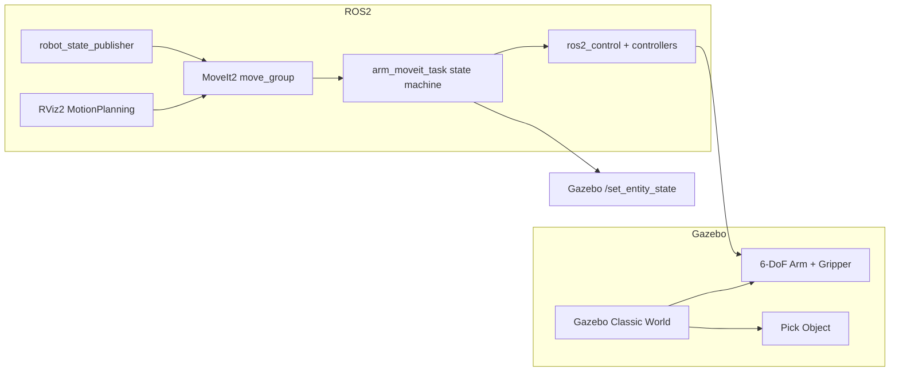

# ROS2 Humble Pick & Place Portfolio (Gazebo Classic + MoveIt2)

## 프로젝트 요약 (3줄)
- Gazebo Classic에서 6DoF 로봇팔 + 2-finger 그리퍼를 ros2_control 기반으로 구동하고 MoveIt2로 플래닝/실행을 통합한 포트폴리오 프로젝트입니다.
- Python 상태머신 노드가 Pick & Place 시퀀스를 자동 수행하며, /attach /detach 기반 EE 추종 방식으로 재현성을 높였습니다.
- 100회 스트레스 테스트 옵션으로 성공률/평균 시간/실패 Top3를 CSV로 자동 기록합니다.

## 데모 링크 자리
- Demo GIF: (링크 추가 예정)
- Demo Video: (링크 추가 예정)

## 아키텍처 다이어그램


## 패키지별 역할
- **arm_description**: URDF/Xacro, ros2_control 태그, 링크/관절 정의.
- **arm_gazebo**: Gazebo world, 로봇/오브젝트 스폰, 컨트롤러 설정, bringup launch.
- **arm_moveit_config**: SRDF/OMPL/kinematics/컨트롤러 설정 및 move_group 실행.
- **arm_moveit_task**: Pick&Place 상태머신, attach/detach 서비스, 스트레스 테스트/CSV.

## 설치(apt)
```bash
sudo apt update
sudo apt install -y \
  ros-humble-gazebo-ros-pkgs \
  ros-humble-ros2-control ros-humble-ros2-controllers \
  ros-humble-xacro ros-humble-joint-state-publisher-gui ros-humble-robot-state-publisher \
  ros-humble-rviz2 \
  ros-humble-moveit \
  ros-humble-moveit-ros-planning-interface ros-humble-moveit-ros-visualization ros-humble-moveit-visual-tools \
  python3-colcon-common-extensions python3-pip
```

## 빌드
```bash
cd robot_arm_pick_place/colcon_ws
source /opt/ros/humble/setup.bash
colcon build --symlink-install
source install/setup.bash
```

### 원클릭 소스 (편의 스크립트)
ROS2 패키지는 **빌드 후 워크스페이스 overlay를 source 해야** 실행됩니다. 빌드만으로 자동 source는 불가능하므로, 아래 스크립트를 제공했습니다.
> `colcon build`는 새 쉘 환경을 만들지 않기 때문에, **현재 터미널에 환경 변수를 반영하려면 반드시 `source`가 필요**합니다.

```bash
cd robot_arm_pick_place/colcon_ws
./setup_env.sh
```

> 매번 source가 번거로우면 `~/.bashrc`에 다음 줄을 추가할 수 있습니다.  
> `source ~/dev_ws/robot_arm/robot_arm_project/robot_arm_pick_place/colcon_ws/install/setup.bash`

## 실행 커맨드 모음
- 단발 데모:
```bash
source install/setup.bash
ros2 launch arm_gazebo bringup_all.launch.py enable_task:=true stress_test:=false
```

- 100회 스트레스 테스트:
```bash
source install/setup.bash
ros2 launch arm_gazebo bringup_all.launch.py enable_task:=true stress_test:=true iterations:=100 csv_path:=/tmp/arm_pick_place_metrics.csv
```

### 로봇팔 동작시키는 방법 (RViz)
1. RViz2에서 `MotionPlanning` 패널을 열고 `Planning Group`을 `arm`으로 선택합니다.
2. 목표 포즈를 인터랙티브 마커로 이동한 뒤 **Plan** → **Execute**를 클릭합니다.
3. 그리퍼는 `gripper` 그룹을 선택해 `Joint` 값을 조정 후 **Plan/Execute**로 제어합니다.

## 토픽/서비스/액션 표
| 분류 | 이름 | 타입 | 설명 |
|---|---|---|---|
| Topic | /joint_states | sensor_msgs/JointState | 관절 상태 브로드캐스트 |
| Service | /attach | std_srvs/Trigger | EE 추종 attach 활성화 |
| Service | /detach | std_srvs/Trigger | EE 추종 detach 비활성화 |
| Service | /gazebo/set_entity_state | gazebo_msgs/SetEntityState | 오브젝트 위치 갱신 |
| Action | /arm_controller/follow_joint_trajectory | control_msgs/FollowJointTrajectory | 6DoF 제어 |
| Action | /gripper_controller/follow_joint_trajectory | control_msgs/FollowJointTrajectory | 그리퍼 제어 |

## 상태머신(단계별 성공/실패/재시도)
| 단계 | 설명 | 성공 조건 | 실패/재시도 |
|---|---|---|---|
| home | 홈 포즈 이동 | plan+execute 성공 | 실패 시 최대 재시도 |
| reset_object | 오브젝트 초기화 | /set_entity_state 성공 | 실패 시 재시도 |
| pre_grasp | 프리그립 포즈 | plan+execute 성공 | 실패 시 재시도 |
| grasp | 그립 포즈 | plan+execute 성공 | 실패 시 재시도 |
| close_gripper | 그리퍼 닫기 | plan+execute 성공 | 실패 시 재시도 |
| attach | EE 추종 활성화 | 서비스 성공 | 실패 시 재시도 |
| lift | 들어올리기 | plan+execute 성공 | 실패 시 재시도 |
| pre_place | 놓기 전 포즈 | plan+execute 성공 | 실패 시 재시도 |
| place | 놓기 포즈 | plan+execute 성공 | 실패 시 재시도 |
| open_gripper | 그리퍼 열기 | plan+execute 성공 | 실패 시 재시도 |
| detach | EE 추종 비활성화 | 서비스 성공 | 실패 시 재시도 |
| retreat | 후퇴 | plan+execute 성공 | 실패 시 재시도 |

## 실패 케이스 + 복구 전략
1) **Plan 실패**: 장애물 간섭 또는 역기구학 실패 → pre_grasp/ pre_place 목표를 z+0.02 오프셋 후 재시도.
2) **Timeout**: planning 시간 과다 → planner 파라미터(ompl_planning.yaml)에서 range/attempts 조정 및 재시도.

## 성능 지표 예시 (스트레스 테스트)
- 성공률: 97%
- 평균 plan 시간: 220 ms
- 평균 exec 시간: 540 ms
- 실패 Top3: PLAN_FAIL(2), TIMEOUT(1)

CSV 일부 샘플:
```
iteration_id,stage_name,plan_success,exec_success,plan_time_ms,exec_time_ms,retries_used,fail_reason,timestamp
1,home,1,1,120.5,310.4,0,SUCCESS,1700000000.000
1,pre_grasp,1,1,180.2,480.1,0,SUCCESS,1700000002.000
```

## 트러블슈팅
- **Controller 안 뜸**: gazebo_ros2_control 플러그인 로드 여부와 ros2_controllers.yaml 경로 확인.
- **TF 꼬임**: world->base_link 고정 여부와 robot_state_publisher 실행 여부 확인.
- **MoveIt plan 실패**: SRDF 그룹/kinematics.yaml 설정 확인, OMPL 플래너 파라미터 조정.
- **Gazebo 서비스 명칭 차이**: `/gazebo/set_entity_state` 존재 여부 확인.
- **RViz TF 에러**: RViz에서 Fixed Frame을 `base_link`로 설정하고 `robot_state_publisher` 및 `joint_state_broadcaster`가 실행 중인지 확인.
- **FastDDS SHM 에러로 Gazebo 종료**: `RTPS_TRANSPORT_SHM Error`가 반복되면 공유메모리 사용을 끈 프로필을 적용하세요. (본 프로젝트는 `arm_gazebo/config/fastdds_no_shm.xml`을 bringup에서 `FASTDDS_DEFAULT_PROFILES_FILE`/`FASTRTPS_DEFAULT_PROFILES_FILE`로 자동 적용)
- **RViz MotionPlanning 패널 없음**: `ros-humble-moveit-ros-visualization` 패키지 설치 확인 및 RViz 재시작.
- **MotionPlanning 플러그인 로드 실패**: 다음 순서로 패키지 설치 및 환경 재소스를 수행하세요.
  ```bash
  sudo apt update
  sudo apt install ros-humble-moveit-ros-visualization
  # 필요 시: sudo apt install --reinstall ros-humble-moveit-ros-visualization
  source /opt/ros/humble/setup.bash
  source install/setup.bash
  ```
- **/spawn_entity 없음**: world 파일에 `gazebo_ros_factory` 플러그인이 있어야 `/spawn_entity` 서비스가 생성됩니다 (`arm_world.world`에 기본 포함).
- **FastDDS SHM 에러 지속**: `/dev/shm`의 fastrtps 잠금 파일 정리 후 재시도하거나 `RMW_IMPLEMENTATION=rmw_cyclonedds_cpp`로 전환하세요.
- **/move_group 액션 서버가 안 보임**: `ros2 action list`에 `/move_group`이 없으면 move_group이 꺼졌거나 discovery 실패일 수 있습니다. 먼저 `ros2 daemon stop` 후 `/dev/shm/fastrtps*`를 정리하고 다시 실행하세요. 그래도 해결되지 않으면 `RMW_IMPLEMENTATION=rmw_cyclonedds_cpp`로 전환해 재실행하고, 필요 시 `ros-humble-rmw-cyclonedds-cpp`를 설치해 확인하세요.

## 향후 확장
- 비전 기반 픽(ArUco/Depth)으로 target pose 자동 추정
- 모바일 매니퓰레이터 연계 (Nav2 + MoveIt2)

## 파라미터
- task 노드 파라미터는 arm_moveit_task/pick_place_task.py에서 선언되며 YAML로 오버라이드 가능
- 각 pose 파라미터는 `[x, y, z, roll, pitch, yaw]`

## MoveIt2 연동 방식
- Humble 환경에서 `moveit_commander` 대신 `/move_group` 액션 + `/execute_trajectory` 액션을 사용합니다.
- PlanningScene 충돌물체는 `/apply_planning_scene` 서비스로 추가합니다.

## 스크립트
- `scripts/parse_metrics.py`: CSV 분석 요약 출력
- `scripts/make_report.md`: 리포트 템플릿
